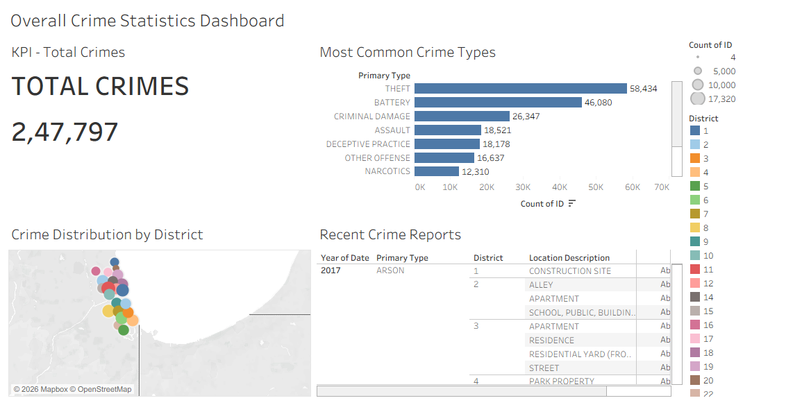
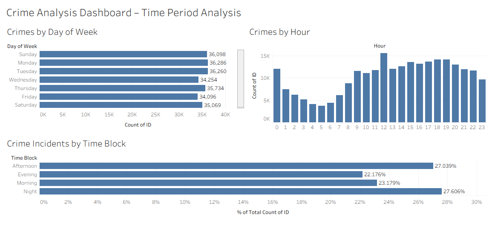
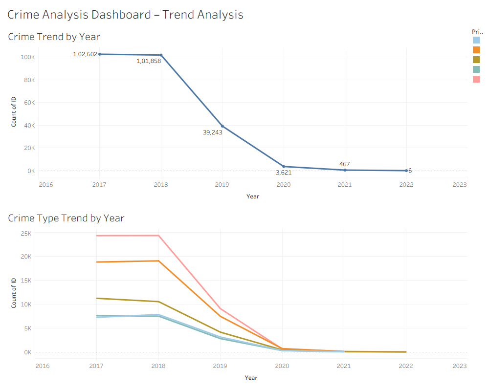
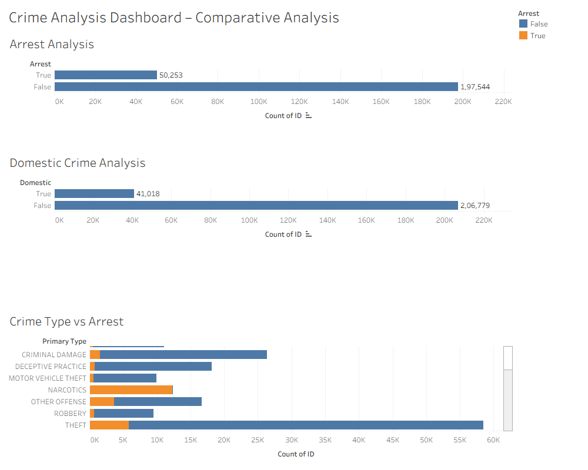

# Crime-Analysis-and-Interactive-Dashboard-Using-Tableau
Developed an interactive Tableau dashboard to analyze crime records, uncovering crime patterns, geographical hotspots, temporal trends, and arrest-related insights. Created multiple dashboards for overall crime statistics, time-based analysis, trend analysis, and comparative analysis to support data-driven decision-making and prevention strategies.

## Project Overview

This project analyzes historical crime data using Tableau to identify crime patterns, geographical hotspots, time-based trends, and comparative factors such as arrest status and domestic crime involvement. Interactive dashboards were developed to transform raw crime records into actionable insights for law enforcement and public safety planning.

## Objectives
- Analyze overall crime statistics and identify major crime categories.
- Identify crime hotspots across districts using geographical visualization.
- Examine crime patterns by day, hour, and time blocks.
- Study crime trends over multiple years.
- Compare crime incidents based on arrest status and domestic involvement.
- Build interactive Tableau dashboards for decision-making support.

## Tools & Technologies
- Tableau Desktop
- Microsoft Excel
- Data Visualization
- Exploratory Data Analysis (EDA)
- Dashboard Design

## Dataset

The dataset contains 247,797 crime records with attributes including:
- Date
- Crime Type
- District
- Location Description
- Arrest Status
- Domestic Indicator
- Latitude & Longitude
- Community Area
- Year

## Dashboards Created
1. Overall Crime Statistics Dashboard
Total Crimes KPI
Most Common Crime Types
Crime Distribution by District
Recent Crime Reports
2. Time Period Analysis Dashboard
Crimes by Day of Week
Crimes by Hour
Crime Incidents by Time Block
3. Trend Analysis Dashboard
Crime Trend by Year
Crime Type Trend by Year
4. Comparative Analysis Dashboard
Arrest Analysis
Domestic Crime Analysis
Crime Type vs Arrest

## Key Insights
- Total reported crimes: 247,797
- Theft was the most frequently reported crime type.
- Crime activity was concentrated in specific districts.
- Night and Afternoon periods recorded the highest proportion of incidents.
- Most crimes did not result in an arrest.
- Non-domestic crimes significantly exceeded domestic crimes.
- Crime incidents showed a declining trend in later years of the dataset.

## Dashboard Preview

### Overall Crime Statistics Dashboard

### Time Period Analysis Dashboard

### Trend Analysis Dashboard

### Comparative Analysis Dashboard

## Business Impact

The dashboards provide a comprehensive view of crime patterns, enabling better resource allocation, crime prevention planning, and data-driven decision-making for law enforcement agencies.
